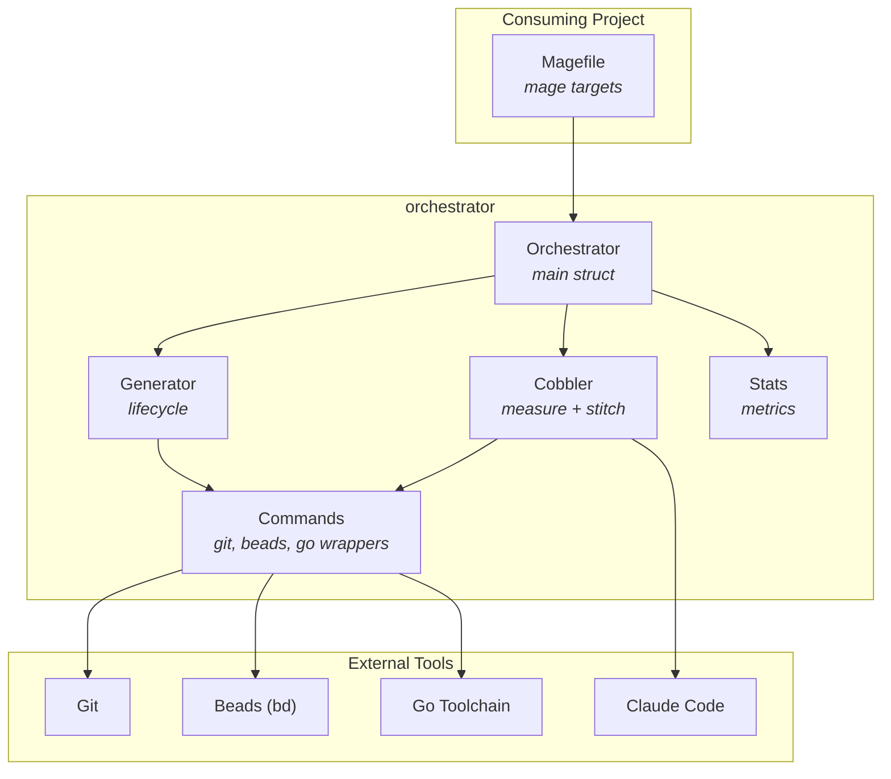

# Architecture Diagrams

Companion diagrams for [ARCHITECTURE.yaml](ARCHITECTURE.yaml).

|  |
|:--:|

```mermaid
graph TD
    subgraph CP["Consuming Project"]
        Magefile["Magefile\n<i>mage targets</i>"]
    end

    subgraph ORCH["orchestrator"]
        Orchestrator["Orchestrator\n<i>main struct</i>"]
        Generator["Generator\n<i>lifecycle</i>"]
        Cobbler["Cobbler\n<i>measure + stitch</i>"]
        Commands["Commands\n<i>git, beads, go wrappers</i>"]
        Stats["Stats\n<i>metrics</i>"]
    end

    subgraph EXT["External Tools"]
        Git
        ClaudeCode["Claude Code"]
        Beads["Beads (bd)"]
        GoToolchain["Go Toolchain"]
    end

    Magefile --> Orchestrator
    Orchestrator --> Generator
    Orchestrator --> Cobbler
    Orchestrator --> Stats
    Generator --> Commands
    Cobbler --> Commands
    Cobbler --> ClaudeCode
    Commands --> Git
    Commands --> Beads
    Commands --> GoToolchain
```

|Figure 1 System context showing orchestrator components and external tools |
